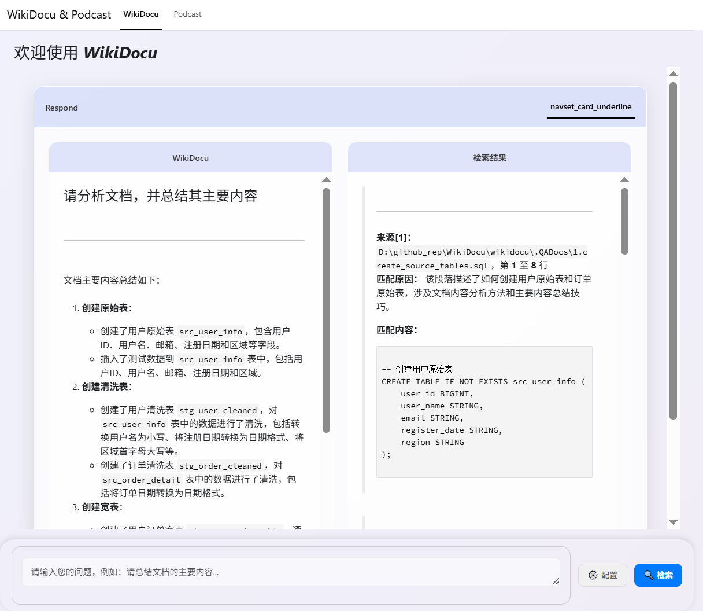

## 📌WikiDocu

WikiDocu 是一个基于 langchain 构建的文档分析工具，旨在帮助用户从本地文件中提取关键信息，并借助大语言模型（LLM）对用户的**研究主题或问题**进行智能理解和回答。它适用于快速查阅技术文档、研究报告、项目说明等文本内容的场景。

与传统的 RAG（Retrieval-Augmented Generation）系统不同，WikiDocu **不依赖向量数据库或语义搜索**，而是通过 LLM 的上下文理解能力，直接对用户提供的文档内容进行分析抽取，并围绕输入的问题生成结构化答案。

#### 😊 举例说明：
假设你有一个项目包含 .md 说明文件及多个 .py 代码文件的文档目录，每个文件都详细描述了不同的 API 接口、使用方法以及相关的代码示例。这些 .md 文件提供了详细的文档说明，包括功能介绍、参数解释和调用示例，而 .py 文件则包含了实现这些 API 的源代码，并附有注释帮助理解其工作原理。

- 💬 **现在，你要找到如何创建一个 Pydantic 模型实例的方法，两种不同的工作流程如下：**

>##### 使用传统 RAG 系统的工作流程：
1. **预处理阶段**：将所有文档转换为向量表示，并存储在向量数据库中。
2.  **查询阶段**：用户输入查询 **如何创建 Pydantic 模型实例**，系统根据查询生成向量，并在向量数据库中查找最相似的文档片段⚠️。
3. **结果呈现**：系统返回与查询最相关的几个文档片段，并可能结合 LLM 对这些片段进行进一步总结。

>##### ✅ 使用 WikiDocu 的工作流程：
1. **加载文档**：选择并加载技术文档目录下的所有 `.md`和`.py ` 文件。
2. **输入查询**：用户在 Web 界面输入 **如何创建 Pydantic 模型实例**。
3. **直接分析**：LLM 直接读取并理解整个文档内容，识别出与查询相关的信息段落 📝。
4. **生成答案**：LLM 根据上下文生成结构化的回答，如图：```根据提供的的文档内容，创建PydanticAgetn实例的方法如下： class PydanticAgetn():...。```



这种方式的优势在于：
- **无需额外索引**：不需要预先构建向量数据库，节省了大量时间和资源。
- **简化部署流程**：减少了系统复杂性，使得部署更加简单快捷。
- **更自然的回答**：由于直接基于全文本理解，生成的回答往往更符合用户的实际需求。

主要特点包括：

- 📁 支持加载本地目录下的多种格式文档：目前仅支持`[".py", ".md", ".txt"]`
- 💬 用户输入研究主题后，LLM 直接分析相关文档并输出总结性回答
- 🧠 无需构建知识库索引或使用向量嵌入，部署简单、响应迅速
- 📝 支持 Markdown 格式渲染展示结果，便于阅读与二次使用

该工具适合用于轻量级文档问答、技术资料辅助阅读、个人知识整理等场景。


## 🧰 技术栈

WikiDocu 基于以下核心技术构建，确保系统的易用性和可扩展性：

| 技术/框架        | 用途说明 |
|------------------|----------|
| **Python 3.10+** | 主要开发语言，提供完整的类型支持和现代语法特性 |
| **Shiny for Python** | 构建交互式 Web 应用界面，实现用户输入与结果展示的可视化 |
| **Pydantic**     | 数据模型定义与校验，提升代码健壮性和可读性 |
| **Markdown**     | 可选：前端展示时解析 Markdown 格式内容，增强输出美观度 |
| **langchain**    | 支持集成大语言模型链式调用，简化 LLM 任务流程 |
| **LLM API（OpenAI / SiliconFlow / 自托管）** | 提供高性能的大语言模型推理服务，负责核心的内容理解与回答生成 |
| **asyncio**      | 异步编程支持，提升多文件处理和网络请求效率 |


### 🔎 为什么选择 LLM 驱动？

WikiDocu 的设计理念是充分利用大语言模型强大的上下文理解和泛化能力，避免引入复杂的检索和向量化流程。相比传统 RAG 架构，这种做法具有以下优势：

- ✅ **无需建立索引或向量数据库**，节省部署成本
- ✅ **更少的中间步骤**，降低系统复杂度
- ✅ **更自然地结合用户意图**，生成符合上下文的回答
- ⚠️ 缺点：受限于 LLM 上下文长度，一次分析的文档总量有限

非常适合**轻量级本地文档问答**、**快速原型验证**等场景。

## 📁 项目结构

```
wiki-docu/
├── src/
│   └── filecontentextract.py       # 核心逻辑：调用 LLM 提取文档内容
│   └── directorytreegenerator.py   # 目录树生成
│   └── models.py                   # 数据模型
│   └── prompts_zh.py               # 提示词
├── frontend/
│   └── utils.py                    # 前端辅助函数：生成报告、样式组件等
├── docs/                           # 默认扫描目录，存放复制的文档
├── app_wikidocu.py                 # app主程序入口
├── cli_wikidocu.py                 # 命令端程序入口
├── README.md                       # 当前文件
└── requirements.txt                # 依赖包列表
```

## 🚀 快速启动

### 1. 安装依赖

```bash
pip install -r requirements.txt
```

### 2. 设置环境变量

在运行前，请确保设置以下环境变量（或修改 `app.py` 中默认值）：

```bash
export MODEL_NAME="Qwen/Qwen2.5-7B-Instruct"
export OPENAI_BASE_URL="https://api.siliconflow.cn/v1"
export OPENAI_API_KEY="your_api_key_here"
```

### 3. 启动应用

***1、app启动*** 
```bash
python app_wikidocu.py
```

访问提示的地址（通常是 `http://127.0.0.1:8000`），即可使用 Web 界面。


***2、命令模式启动*** 
```bash
python cli_wikidocu.py
```


## 🧪 功能说明

- **wikidocu**：主输出区，显示最终的分析报告。
- **检索结果**：详细输出区，展示原始提取的文档内容片段。
- **输入框**：可输入问题，后点击“检索”开始执行。

## 📦 主要依赖项

```txt
langchain_core==0.3.67
langgraph==0.5.0
pydantic==2.10.6
shiny==1.4.0 
```

## 🤝 贡献指南

欢迎提交 Issue 和 Pull Request！请遵循以下流程：

1. Fork 本仓库
2. 创建新分支 (`git checkout -b feature/new-feature`)
3. 提交更改 (`git commit -m 'Add some feature'`)
4. Push 到分支 (`git push origin feature/new-feature`)
5. 创建 Pull Request

## 📜 License

MIT License - 见 [LICENSE](LICENSE) 文件。
