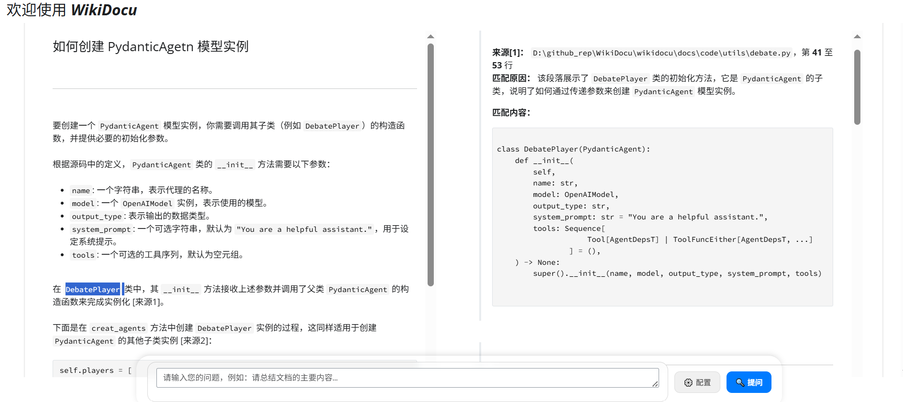
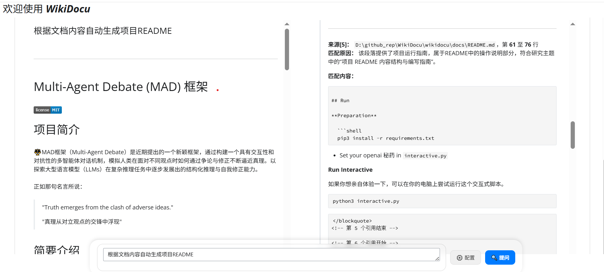

<div align="center">

# WikiDocu: Intelligent Document Q&A


</div>

### English| [简体中文](README_zh-CN.md) 

## Project Introduction

WikiDocu is an innovative local intelligent document question-answering system. It abandons the complex vector database and semantic retrieval processes found in traditional Retrieval-Augmented Generation (RAG) systems, instead directly leveraging the powerful contextual understanding and generalization capabilities of Large Language Models (LLMs) to perform joint analysis of user-specified local documents, achieving precise and traceable Q&A.

Building upon this, the project integrates a powerful Podcast-LLM module. This module can not only extract information from documents for Q&A but also automatically generate natural and fluent podcast dialogue scripts from document content (or research topics), which are then synthesized into natural and fluent audio through TTS technology. Users can learn technical content by listening to podcasts during commutes, exercise, or rest, improving knowledge acquisition efficiency. It supports multiple TTS voice models and tone selections, and can generate various audio formats such as MP3 and WAV, making it convenient to play on various devices. This diversifies knowledge acquisition methods, extending from "reading" and "asking" to "listening".

### 🎯 Core Value Proposition
- **Summarize massive documents, precise answers with one question**
- **No retrieval needed, direct access to document core**
- **Document content, one-click podcast generation**

### 📚 Application Scenarios
- Research institutions convert academic papers and technical reports into podcasts for in-depth interpretation of research content through Q&A format
- Enterprises convert product manuals and user guides into podcasts to enhance users' understanding and usage efficiency of products

## 🚨 Pain Points and Challenges

In daily learning, work, and R&D, we face numerous document processing-related pain points:

### 🔍 Information Retrieval Difficulties
*   **🔍 Low information search efficiency**: Facing massive local document libraries (technical documents, code, reports, etc.), the traditional "folder-keyword search" method is like looking for a needle in a haystack, time-consuming and difficult to locate core information.
*   **📚 High understanding costs**: After finding relevant document fragments, it often takes a lot of time to read and understand the context to obtain the truly needed knowledge.

### ⚙️ Complex Technical Implementation
*   **🔧 Complex RAG system deployment**: Although RAG-based systems are powerful, they require building and maintaining vector databases, processing complex embeddings, and retrieval processes, demanding high technical thresholds and computing resources.

### 💡 Knowledge Management Dilemmas
*   **💾 Knowledge difficult to reuse effectively**: The large amount of documents and knowledge accumulated by individuals or teams often remains dormant on hard drives due to lack of effective management and retrieval tools, unable to be transformed into immediate productivity.
*   **❓ Imprecise Q&A, lacking evidence**: Some Q&A systems provide vague and broad answers, or "hallucinate" (fabricate facts), lacking clear sources and contextual support, reducing credibility.
*   **📱 Single knowledge acquisition method**: Traditional document reading and Q&A interactions are limited to visual and textual forms, lacking more convenient and diverse information acquisition methods, making it difficult to adapt to users' learning needs in different scenarios (such as commuting, exercising).

## Solution: WikiDocu

WikiDocu is an innovative local intelligent document Q&A system. It takes a unique approach, **without building vector databases or performing complex semantic retrieval**, but directly utilizing the powerful contextual understanding and generalization capabilities of Large Language Models (LLMs) to perform full-text analysis of user-specified local documents.

### System Architecture and Core Process

WikiDocu's core engine is built on **LangGraph**, forming an intelligent processing flow with state awareness and conditional branching capabilities. This process closely integrates user queries, document content, and LLM capabilities to achieve automated transition from questions to precise answers. The core process is as follows:

1.  **Query Understanding & Enhancement**
    *   **Input**: Natural language questions entered by users in Web UI or CLI.
    *   **Processing**: The system first calls LLM for deep semantic parsing of the original question. LLM analyzes the user's real intent, identifies key entities and concepts, and transforms vague or broad questions into one or more more precise and actionable search topics (`search_query`). For example, if a user asks "How to deploy this project?", the system might generate `search_query: "deployment instructions", "installation guide"`.
    *   **Output**: One or more optimized `search_query` for guiding subsequent document content retrieval.

2.  **Intelligent Routing**
    *   **Input**: Enhanced `search_query`.
    *   **Processing**: The system enters a decision node. LangGraph judges based on the nature of `search_query`:
        *   **Non-document query**: If the question is casual chat, greeting, or unrelated to the document library (such as "How are you?"), the process will directly route to the **direct response node**, where LLM generates a friendly reply.
        *   **Document query**: If the question clearly points to document content, the process triggers the **file content extraction** step.
    *   **Output**: Decision on subsequent execution path (direct response or file content extraction).

3.  **File Content Extraction**
    *   **Input**: `search_query` from the "intelligent routing" step, and all supported format files in the `./.QADocs` directory.
    *   **Processing**:
        *   The system traverses the `./.QADocs` directory, reading the content of each file. Based on each file's content introduction, it decides which files to access.
        *   For each accessed file, the system formats its content by line number (e.g., `[line number] file content`), then submits this formatted text, `search_query`, and a preset structured output template (such as JSON Schema) together to a dedicated LLM module.
        *   The LLM module's task is to **precisely identify** text segments in the file highly related to `search_query`. It must return results in **structured output** format, including:
            *   `file_path`: Relative path of the file.
            *   `start_line`: Start line number of the relevant segment.
            *   `end_line`: End line number of the relevant segment.
            *   `reason`: Reason for matching (brief explanation of why this segment is relevant).
        *   The system collects matching results from all files.
    *   **Output**: A structured result list containing all matching segment information (file path, line number range, matching reason).

4.  **Citation Validity Assessment**
    *   **Input**: Structured result list from the "file content extraction" step.
    *   **Processing**: This is a new key quality control环节. The system submits each retrieved matching segment (original text fragment extracted based on file path and line number range) along with its `reason` and original `search_query` to LLM for **secondary verification**.
        *   LLM's task is to judge: **Does this segment really and directly answer the query point represented by `search_query`?** It needs to evaluate the segment content's relevance, completeness, and accuracy.
        *   For each segment, LLM outputs a **validity judgment** (e.g., `valid`, `partially_valid`, `invalid`) and brief reasoning.
    *   **Output**: A **validity-filtered and annotated** citation result list. Invalid or low-quality citations are eliminated or downgraded, ensuring only high-confidence content enters the subsequent process. This step effectively prevents "hallucinated" information or mismatched content from polluting the final answer.

5.  **Sufficiency Check**
    *   **Input**: Citation result list after validity judgment, and the user's original question.
    *   **Processing**: This is the core evaluation环节. The system calls LLM to compare the user's original question with all **valid citation content** currently obtained.
        *   LLM's task is to judge: **Based on these valid citations, is all the information needed to generate a complete and accurate answer available?** That is, is the information "sufficient"?
        *   Judgment may produce three results:
            *   **Sufficient**: Information is sufficient, can proceed to final answer generation.
            *   **Insufficient**: Information is incomplete, needs **supplementary retrieval**. The system may need to generate new, more specific `search_query`, or expand the retrieval scope (such as scanning subdirectories, including more file types), then return to the "file content extraction" step.
            *   **Unanswerable**: After multiple attempts, the system confirms there is insufficient information in the document library to answer the question.
    *   **Output**: A decision on information sufficiency (`sufficient`, `insufficient`, `unanswerable`).

6.  **Citation Report Generation**
    *   **Input**: Valid citation result list confirmed as "sufficient" from the "sufficiency check" step.
    *   **Processing**: The system automatically organizes these high-quality, confirmed valid citation results into a clear, **Markdown-formatted report with citations**. Each matching item in the report clearly annotates the source file, line number range, and validity assessment summary.
    *   **Output**: A formatted, high-confidence citation report.

7.  **Final Answer Generation**
    *   **Input**: User's original question + generated citation report.
    *   **Processing**: The original question and detailed citation report are submitted as context, and LLM is called again. LLM's task is to synthesize all **verified valid information** to generate a **final, structured, easy-to-understand answer**. The answer will clearly annotate information sources (e.g., `[1]`, `[2]`) and link to specific entries in the citation report.
    *   **Output**: A final response containing the answer and source citations. If judged as "unanswerable", a clear prompt is generated informing the user "No relevant information found based on existing documents".

8.  **State Management & Orchestration**
    *   **Core**: The entire process is unified managed by **LangGraph**. LangGraph is responsible for:
        *   **State maintenance**: Saving user queries, intermediate results (`search_query`, retrieval results, validity judgments, sufficiency assessments, citation reports), and final state.
        *   **Process orchestration**: Automatically driving process flow based on predefined graph structure and decision logic (especially the newly added "validity judgment" and "sufficiency check" nodes). It supports **loops** (returning to retrieval step when judged as "insufficient") and **conditional branches**.
        *   **Error handling and retry**: In case of LLM call failure or unexpected output, it can retry or execute backup strategies.
    *   **Advantages**: This graph-based architecture with feedback loops ensures interaction continuity, logical rigor, and actively guarantees answer quality and completeness, providing users with highly reliable services.

The entire process is managed by `LangGraph` for state and flow, ensuring interaction continuity and logical coherence.

## 🌟 Core Highlights and Innovations

### 1. 💡 Direct Understanding, No Indexing
*   **Innovation**: Unlike traditional RAG, WikiDocu directly inputs document content to LLM, eliminating the steps of index building, vector storage, and similarity retrieval, greatly simplifying the deployment process and reducing resource consumption.

### 2. 🎯 Precise Q&A with Traceable Sources
*   **Innovation**: After users ask questions, WikiDocu guides LLM to directly search for relevant information in documents and can precisely return the file name and line number range of relevant paragraphs, ensuring answer accuracy and traceability.

### 3. 🖥️ Dual-Mode Interaction, Flexible and Convenient
*   **Innovation**: Provides both intuitive Web UI interface and efficient CLI command-line tools.
*   **Web UI (`app_wikidocu.py`)**:
    *   Graphical operation, easy to use.
    *   Real-time display of Q&A process and results.
    *   Supports interface configuration of model parameters and document paths.
*   **CLI (`cli_wikidocu.py`)**:
    *   Meets fast query needs of developers and technical personnel.
    *   Supports script calls, easy to integrate.
    *   Configures model parameters through environment variables.
*   **Advantages**: Meets needs of different user groups and application scenarios.

### 4. 📝 Structured Output, Easy to Reuse
*   **Innovation**: System-generated answers and retrieval basis support Markdown format, which is not only beautiful and readable but also convenient for users to organize, share, or integrate into other documents later.

### 5. ⚡ Lightweight Deployment, Fast Response
*   **Innovation**: The simplified architecture makes WikiDocu easy to install and deploy, able to quickly respond to user queries.

### 6. 🎧 Automated Podcast Content Generation
*   **Innovation**: Integrates Podcast-LLM module to convert text knowledge into auditory content.
*   **Features**:
    *   **Research Mode**: Automatically researches online based on a topic to generate podcasts.
    *   **Context Mode**: Generates podcasts based on user-provided documents, web pages, videos, and other materials.
    *   **Natural Dialogue**: Simulates Q&A dialogue between host and expert, enhancing realism and interest.
    *   **Multi-format Output**: Generates structured text scripts and high-quality MP3/WAV audio files.
    *   **Multi-model Support**: Compatible with OpenAI, Google, Anthropic models, and platforms compatible with OpenAI protocol like ModelScope.
*   **Advantages**:
    *   **New Knowledge Acquisition Method**: Users can learn by "listening" during commutes, exercise, or rest.
    *   **Content Reuse**: Converts static documents into more easily disseminated audio content.
    *   **Efficient Information Refinement**: Highlights core information through Q&A dialogue format.

## 🛠️ Technical Architecture and Key Technologies

### Core Components
*   **Core Engine**: Python, LangChain, LangGraph
*   **Interaction Interface**: Shiny for Python (Web UI), Native Python (CLI)
*   **Model Support**: Compatible with OpenAI API and mainstream LLM platforms (such as DashScope, SiliconFlow, ModelScope, etc.).
*   **Podcast Generation**: Integrates Podcast-LLM module, supports multiple TTS services (Google Cloud TTS, ElevenLabs, DashScope, SiliconCloud, etc.).

### Core Technologies
*   **LangGraph State Management**: Manages complex dialogue states and processing flows.
*   **LLM Structured Output**: Achieves precise information extraction and citation generation.
*   **Pydantic Data Models**: Defines and validates LLM's structured output.
*   **Multi-source Content Extraction**: Supports various formats including PDF, Word, web pages, audio/video.
*   **Dynamic Prompt Engineering**: Designs specific prompts for different processing nodes.

## 📊 Application Scenarios

### 🏢 Enterprise Application Scenarios
*   **Technical Document Quick Search and Understanding**: Quickly understand SDKs, API documentation, or code libraries.
*   **Enterprise Knowledge Base Management**: Efficiently retrieve internal documents, contracts, and policies.
*   **Financial Compliance Review**: Banks or financial institutions can put internal compliance policies, regulatory documents, and audit reports into the system, quickly checking specific transactions or business processes for compliance through questioning, improving compliance review efficiency.
*   **Legal Contract Search**: Law firms or legal departments can use WikiDocu to quickly find specific clauses (such as liability for breach of contract, confidentiality agreement validity period) in large numbers of contracts, assisting contract drafting and risk assessment.

### 🎓 Education and Research Scenarios
*   **Research Report and Paper Analysis**: Extract core viewpoints and data.
*   **Educational Material Tutoring**: Teachers or students can import course handouts and teaching materials, quickly locating knowledge points, obtaining summaries or explanations through questioning, achieving personalized learning.
*   **Medical Record Analysis**: Hospitals can input structured electronic medical records or clinical guidelines into the system, allowing doctors to quickly obtain relevant diagnostic suggestions, drug contraindications, or treatment plans through natural language questioning, assisting clinical decision-making.

### 👨‍💻 Personal Learning Scenarios
*   **Personal Learning and Note Organization**: Manage and query personal knowledge.
*   **Multi-scenario Knowledge Listening**: Users can generate podcasts from interesting documents or topics, listening to podcasts to acquire and review knowledge during commutes, exercise, housework, and other inconvenient reading scenarios.

### 🎙️ Content Creation Scenarios
*   **Podcast Content Creation**:
    *   Convert technical documents, research reports, and news into podcasts.
    *   Enterprises can podcast training materials and product instructions for employee learning.
    *   Academic institutions can podcast papers for easier dissemination and understanding.

## 📚 Application Examples

### 📰 Example 1: Network (News) Knowledge Q&A
Based on a Sina Finance news article "[National Financial Regulatory Administration Releases 'Personal Loan Management Measures', Effective July 1st](https://finance.sina.com.cn/wm/2024-02-03/doc-inaftiir0348604.shtml)", conduct policy interpretation, clause inquiry, scope of application consultation, and operational guidance Q&A, helping financial institutions and the public accurately understand new regulatory requirements, standardize loan business processes, and improve compliance management levels. Applicable to financial industry policy inquiry and product consultation.


📹 **Demo Video**: [News Q&A](./imgs/finance.mp4)

---

### 💻 Example 2: Project Code Interpretation & Automatic README Generation
Query, consult, and ask questions about local project code to deeply understand code logic, solve development difficulties, and improve code maintenance and collaboration efficiency. Applicable to code query, newcomer training, troubleshooting, document generation, and architecture interpretation.

  

📹 **Demo Videos**: [Local Project Code Q&A](./imgs/coder.mp4), [Generate Project README](./imgs/generate_readme.mp4)

---

### 🎧 Example 3: Podcast Generation
Automatically convert the three measures revised and issued by the National Financial Regulatory Administration [Personal Loan Management Measures, Fixed Asset Loan Management Measures, Working Capital Loan Management Measures](https://finance.sina.com.cn/wm/2024-02-03/doc-inaftiir0348604.shtml) into high-quality audio podcasts, simulating Q&A dialogue between host and expert.


📄 [View Podcast Script](./imgs/episode.txt) | 🔊 [Click to Play Audio](./imgs/episode.mp3)

## 🚀 Quick Start

### 1. Environment Preparation
- Install Python 3.10+
- Download source code: `git clone https://github.com/jinhongzou/wikidocu.git`
- Install dependencies: 
```bash
cd wikidocu
pip install -r requirements.txt
```

### 2. Configuration Variables
Copy the `.env_example` file and rename it to `.env`, then fill in the API keys and other configuration items according to your actual situation. Here are the main configuration item descriptions:

- `OPENAI_API_KEY`: Your main LLM API key (e.g., provided by SiliconFlow or DashScope).
- `OPENAI_BASE_URL`: Your main LLM API base URL (e.g., SiliconFlow's `https://api.siliconflow.cn/v1`).
- `OPENAI_MODEL`: The specific model name you want to use (e.g., `Qwen/Qwen2.5-7B-Instruct` or `qwen-plus`).
- `FAST_LLM_BASE_URL`: (Podcast function only) Fast response LLM base URL, used for podcast outline generation and script writing.
- `LONGCONTEXT_LLM_BASE_URL`: (Podcast function only) Long text processing LLM base URL, used for podcast content research and extraction.
- `TAVILY_API_KEY`: (Podcast function only) Tavily search API key, used for podcast content research.
- `WIKIDOCU_QA_DIR`: WikiDocu default Q&A document directory, defaults to `.QADocs`.

For detailed configuration instructions, please refer to the `.env_example` file in the project root directory.

### 3. Start Application
*   **Web UI Mode**: Run `python app_wikidocu.py`, access `http://127.0.0.1:8000`.
*   **CLI Mode**: Run `python cli_wikidocu.py`.

### 4. Configure Model and Source File Directory
*   **Web UI Mode**: After starting the application, click the "⚙️ Configuration" button in the interface to set up. In the pop-up modal box, users can configure model parameters (API Key, model name, base URL) and source file directory path.
*   **CLI Mode or Web UI Default Values**: Set environment variables `OPENAI_API_KEY`, `OPENAI_BASE_URL`, `OPENAI_MODEL`. Source file directory defaults to `./.QADocs`.

### 5. Start Q&A
Enter your question in the interface or command line. Click the "🚀 Ask" button, and the system will process your question and return results.

## 📜 License and Acknowledgements

### License
This project is licensed under the MIT License - see the [LICENSE](LICENSE) file for details.

### Third-Party Components and Dependencies
This project uses the following open-source components, and we would like to express our gratitude to their developers:

*   **[LangChain](https://github.com/langchain-ai/langchain)** - Framework for developing applications powered by language models. Licensed under [Apache 2.0 License](https://www.apache.org/licenses/LICENSE-2.0).
*   **[LangGraph](https://github.com/langchain-ai/langgraph)** - Library for building stateful, multi-actor applications with LLMs. Licensed under [Apache 2.0 License](https://www.apache.org/licenses/LICENSE-2.0).
*   **[Shiny for Python](https://github.com/posit-dev/py-shiny)** - Web framework for building interactive web applications with Python. Licensed under [MIT License](https://opensource.org/licenses/MIT).
*   **[Pydantic](https://github.com/pydantic/pydantic)** - Data validation and settings management using Python type hints. Licensed under [MIT License](https://opensource.org/licenses/MIT).
*   **[Tavily Python](https://github.com/tavily-ai/tavily-python)** - Python SDK for the Tavily API. Licensed under [MIT License](https://opensource.org/licenses/MIT).
*   **[Podcast-LLM](https://github.com/evandempsey/podcast-llm)** - Automatically generate engaging AI-powered podcasts from research papers, news articles, and other long-form content. Licensed under [Creative Commons Attribution-NonCommercial 4.0 International (CC BY-NC 4.0)](https://creativecommons.org/licenses/by-nc/4.0/).
*   And other dependencies listed in [requirements.txt](requirements.txt), all of which have permissive open-source licenses.

### Attributions
This project was developed with the assistance of Qwen3 Coder and incorporates concepts and code patterns commonly found in the LLM application development community. While we have strived to respect all relevant licenses and attribution requirements, if you believe there is any content that requires additional attribution or is used inappropriately, please contact us.

