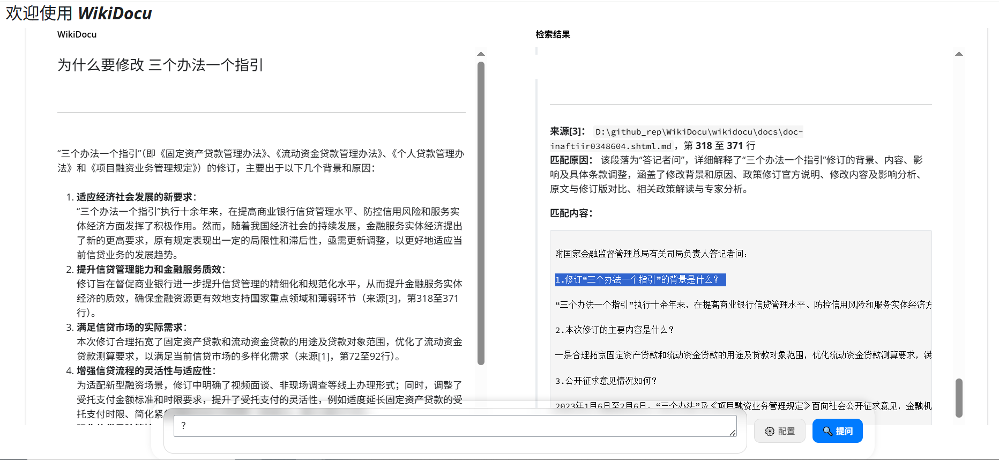

# 📌 WikiDocu - 基于大模型的本地智能文档问答系统

### 简体中文| [English](README.md) 

*   **归纳海量文档，一问精准直达**
*   **无需检索，直通文档核心——像对话一样读懂文件。**

## 详细介绍

### 痛点与挑战

在日常学习、工作和研发中，我们面临着诸多与文档处理相关的痛点：

*   **信息查找效率低下：** 面对庞大的本地文档库（技术文档、代码、报告等），传统的“文件夹-关键字搜索”方式犹如大海捞针，耗时且难以定位核心信息。
*   **理解成本高昂：** 找到相关文档片段后，往往还需要投入大量时间去阅读和理解上下文，才能获取真正需要的知识。
*   **RAG系统部署繁琐：** 基于检索增强生成（RAG）的系统虽然强大，但需要构建和维护向量数据库、处理复杂的嵌入（Embedding）和检索流程，对技术门槛和计算资源要求较高。
*   **知识难以有效复用：** 个人或团队积累的大量文档和知识，由于缺乏有效的管理和检索工具，常常沉睡在硬盘中，无法转化为即时的生产力。
*   **问答不精准，缺乏依据：** 一些问答系统给出的答案模糊宽泛，或者“ hallucinate ”（编造事实），缺乏明确的出处和上下文支撑，降低了可信度。

### WikiDocu 核心亮点与创新

WikiDocu 是本地智能文档问答系统，它**无需构建向量数据库或进行复杂的语义检索**，而是直接利用大语言模型（LLM）强大的上下文理解和泛化能力，对用户指定的本地文档进行全文分析。

1.  **直接理解，无需索引：** 区别于传统RAG，WikiDocu 直接将文档内容输入LLM，省去了索引构建、向量存储和相似度检索的步骤，极大地简化了部署流程，降低了资源消耗。
2.  **精准问答，出处可循：** 用户提出问题后，WikiDocu 会引导LLM直接在文档中查找相关信息，并能精确地返回相关段落所在的文件名和行号范围，确保答案的准确性和可追溯性。
3.  **双模交互，灵活便捷：**
    *   **Web UI 界面:** 提供直观友好的图形界面，用户可以轻松上传文档、输入问题、查看结构化答案和详细的检索依据。支持通过界面配置模型参数。
    *   **CLI 命令行:** 满足开发者和技术人员的快速查询需求，操作更简洁高效。通过环境变量配置模型参数。
4.  **结构化输出，易于复用：** 系统生成的答案和检索依据均支持 Markdown 格式，不仅美观易读，也方便用户后续整理、分享或集成到其他文档中。
5.  **轻量部署，快速响应：** 简化的架构使得 WikiDocu 易于安装和部署，能够快速响应用户的查询请求。

### 应用场景

*   **技术文档速查：** 快速了解开源项目、SDK或API文档中的关键功能和用法。
*   **代码库理解：** 通过提问快速掌握大型代码库的结构、模块功能和核心逻辑。
*   **研究报告分析：** 从长篇技术报告或论文中快速提取核心观点和数据。
*   **个人知识整理：** 高效管理和检索个人积累的笔记、资料等非结构化文本。
*   **金融合规审查：** 银行或金融机构可以将内部合规政策、法规文档、审计报告等放入系统，通过提问快速核查特定交易或业务流程是否符合规定，提高合规审查效率。
*   **法律合同检索：** 律师事务所或法务部门可利用WikiDocu快速在大量合同中查找特定条款（如违约责任、保密协议有效期等），辅助合同起草和风险评估。
*   **医疗病历分析：** 医院可将结构化的电子病历或诊疗指南输入系统，医生通过自然语言提问快速获取相关诊断建议、用药禁忌或治疗方案，辅助临床决策。
*   **教育资料辅导：** 教师或学生可以将课程讲义、教材内容导入，通过提问快速定位知识点、获取总结或解释，实现个性化学习。

- **示例1：** *为什么要修改 三个办法一个指引*  
根据新浪财经一则 “[国家金融监督管理总局发布《个人贷款管理办法》，7月1日起施行](https://finance.sina.com.cn/wm/2024-02-03/doc-inaftiir0348604.shtml)“ 的新闻内容，开展政策解读、条款查询、适用范围咨询及实际操作指引问答，帮助金融机构和公众准确理解新规要求，规范贷款业务流程，提升合规管理水平。适用于金融行业政策查询、产品咨询。

- **演示视频**: [新闻问答](./imgs/finance.mp4)

- **示例2：** *如何创建 PydanticAgetn 模型实例*  
对本地项目代码进行查询、咨询与问答，深入理解代码逻辑，解决开发中的疑难问题，提升代码维护与协作效率。适用于代码查询、新人培训、故障排查、文档生成、架构解读。

- **演示视频**: [本地项目代码问答](./imgs/coder.mp4)

- **示例3：** *根据文档内容自动生成项目READM*  
根据项目文档内容自动生成结构完整、信息清晰的README文件，涵盖项目简介、安装步骤、使用说明、配置参数、接口文档及常见问题等内容，提升项目可读性与协作效率。适用于项目文档生成、项目介绍、项目协作。

- **演示视频**: [生成项目readme文档](./imgs/generate_readme.mp4)

## 立即体验

项目已开源，只需简单的环境配置和依赖安装，即可快速启动 WikiDocu，开启您的智能文档探索之旅！

### 使用说明

1.  **环境准备：** 安装 Python 3.10+，使用 `pip install -r requirements.txt` 安装依赖。
2.  **启动应用：**
    *   Web UI 模式：运行 `python app_wikidocu.py`，访问 `http://127.0.0.1:8000`。
    *   CLI 模式：运行 `python cli_wikidocu.py`。
3.  **配置模型与源文件目录：**
    *   **Web UI 模式：** 启动应用后，在界面中点击"⚙️ 配置"按钮进行设置。在弹出的模态框中，用户可以配置模型参数（API Key、模型名称、基础 URL）以及源文件目录路径。
    *   **CLI 模式 或 Web UI 默认值：** 设置环境变量 `OPENAI_API_KEY`, `OPENAI_BASE_URL`, `OPENAI_MODEL`。源文件目录默认为 `./docs`。
4.  **开始问答：** 在界面或命令行中输入您的问题。点击"🚀 提问"按钮，系统将处理您的问题并返回结果。

