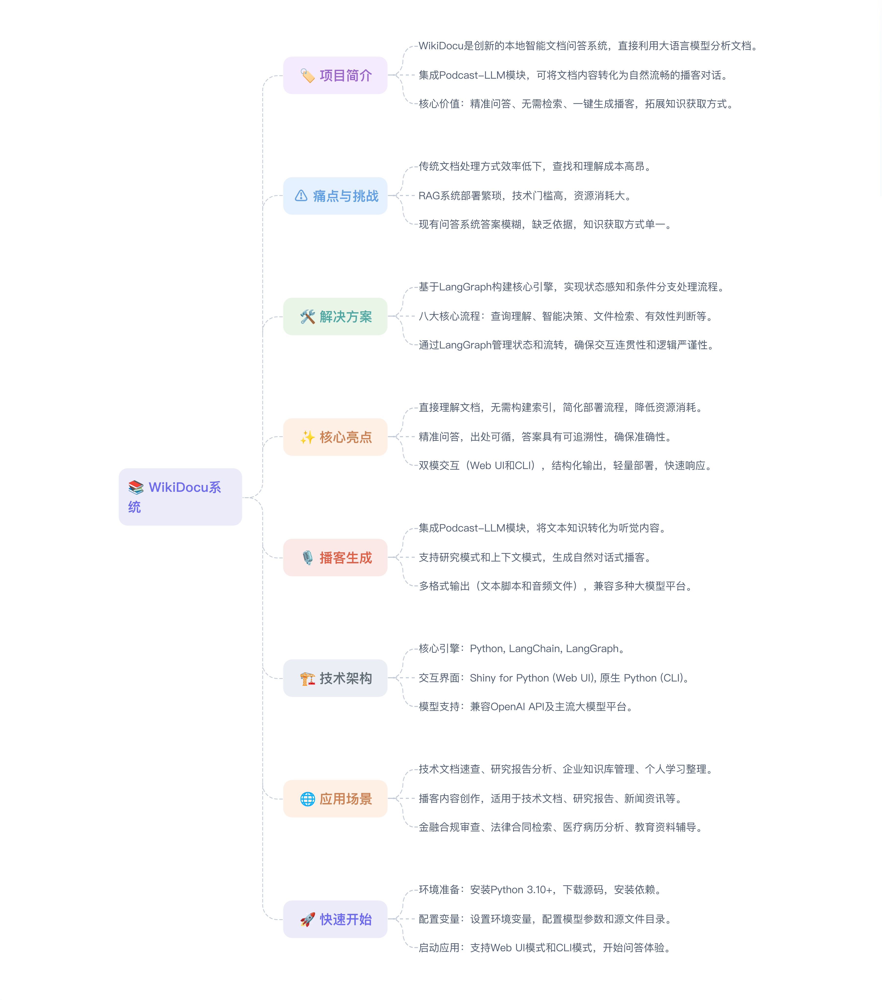

<div align="center">

# WikiDocu：智能文档问答



</div>


### 简体中文| [English](README.md) 


## 项目简介

WikiDocu 是一个创新的本地智能文档问答系统，它摒弃了传统检索增强生成（RAG）系统中复杂的向量数据库和语义检索流程，直接利用大语言模型（LLM）强大的上下文理解和泛化能力，对用户指定的本地文档进行联合分析，实现精准、可追溯的问答。

在此基础上，本项目集成了强大的 Podcast-LLM 模块，不仅能从文档中提取信息进行问答，还能将文档内容（或研究主题）自动生成自然流畅的播客对话脚本，然后通过TTS技术合成自然流畅的音频。用户可以在通勤、运动或休息时通过听播客的方式了解技术内容，提升知识获取效率。支持多种TTS语音模型和音色选择，可生成MP3、WAV等多种音频格式，便于在各种设备上播放。这使得知识获取的方式更加多样化，从"读"和"问"延伸到了"听"。

### 🎯 核心价值主张
- **归纳海量文档，一问精准直达**
- **无需检索，直通文档核心**
- **文档内容，一键生成播客**

### 📚 应用场景
- 研究机构将学术论文、技术报告转换为播客，通过问答形式深入解读研究内容
- 企业将产品说明、用户手册转换为播客，提升用户对产品的理解和使用效率

## 🚨 痛点与挑战

在日常学习、工作和研发中，我们面临着诸多与文档处理相关的痛点：

### 🔍 信息检索难题
*   **🔍 信息查找效率低下**：面对庞大的本地文档库（技术文档、代码、报告等），传统的"文件夹-关键字搜索"方式犹如大海捞针，耗时且难以定位核心信息。
*   **📚 理解成本高昂**：找到相关文档片段后，往往还需要投入大量时间去阅读和理解上下文，才能获取真正需要的知识。

### ⚙️ 技术实现复杂
*   **🔧 RAG系统部署繁琐**：基于检索增强生成（RAG）的系统虽然强大，但需要构建和维护向量数据库、处理复杂的嵌入（Embedding）和检索流程，对技术门槛和计算资源要求较高。

### 💡 知识管理困境
*   **💾 知识难以有效复用**：个人或团队积累的大量文档和知识，由于缺乏有效的管理和检索工具，常常沉睡在硬盘中，无法转化为即时的生产力。
*   **❓ 问答不精准，缺乏依据**：一些问答系统给出的答案模糊宽泛，或者" hallucinate "（编造事实），缺乏明确的出处和上下文支撑，降低了可信度。
*   **📱 知识获取方式单一**：传统的文档阅读和问答交互局限于视觉和文本，缺乏更便捷、多样的信息获取形式，难以适应用户在不同场景（如通勤、运动）下的学习需求。

## 解决方案: WikiDocu

WikiDocu 是一款创新的本地智能文档问答系统。它独辟蹊径，**无需构建向量数据库或进行复杂的语义检索**，而是直接利用大语言模型（LLM）强大的上下文理解和泛化能力，对用户指定的本地文档进行全文分析。

### 系统架构与核心流程

WikiDocu 的核心引擎基于 **LangGraph** 构建，形成一个具备状态感知和条件分支能力的智能处理流程。该流程将用户查询、文档内容与大语言模型（LLM）的能力紧密结合，实现从问题到精准答案的自动化流转。其核心流程如下：

1.  **查询理解与增强 (Query Understanding & Enhancement)**
    *   **输入**：用户在 Web UI 或 CLI 中输入的自然语言问题。
    *   **处理**：系统首先调用 LLM 对原始问题进行深度语义解析。LLM 分析用户的真实意图、识别关键实体和概念，并将模糊或宽泛的问题转化为一个或多个更精确、更具可操作性的检索主题（`search_query`）。例如，用户问"这个项目怎么部署？"，系统可能生成 `search_query: "deployment instructions", "installation guide"`。
    *   **输出**：一个或多个优化后的 `search_query`，用于指导后续的文档内容检索。

2.  **智能决策 (Intelligent Routing)**
    *   **输入**：经过增强的 `search_query`。
    *   **处理**：系统进入一个决策节点。LangGraph 根据 `search_query` 的性质进行判断：
        *   **非文档查询**：如果问题属于闲聊、问候或与文档库无关（如"你好吗？"），流程将直接路由到 **直接响应节点**，由 LLM 生成友好回复。
        *   **文档查询**：如果问题明确指向文档内容，则流程触发 **文件内容检索** 步骤。
    *   **输出**：决定后续执行路径（直接响应 或 文件内容检索）。

3.  **文件内容检索 (FileContentExtract)**
    *   **输入**：来自"智能决策"步骤的 `search_query`，以及 `./.QADocs` 目录下的所有支持格式的文件
    *   **处理**：
        *   系统遍历 `./.QADocs` 目录，读取每个文件的内容。根据每个文件内容介绍，决定要访问哪些文件。
        *   对于访问的每个文件，系统将其内容按行号进行格式化（例如，`[行号] 文件内容`），然后将此格式化文本、`search_query` 以及一个预设的结构化输出模板（如 JSON Schema）一同提交给一个专门的 LLM 模块。
        *   该 LLM 模块的任务是：**精确识别**文件中与 `search_query` 高度相关的文本段落。它必须以**结构化输出**（Structured Output）的形式返回结果，包括：
            *   `file_path`: 文件的相对路径。
            *   `start_line`: 相关段落的起始行号。
            *   `end_line`: 相关段落的结束行号。
            *   `reason`: 匹配的原因（简要说明为何此段落相关）。
        *   系统收集所有文件的匹配结果。
    *   **输出**：一个包含所有匹配段落信息（文件路径、行号范围、匹配原因）的结构化结果列表。

4.  **引用内容有效性判断 (Citation Validity Assessment)**
    *   **输入**：来自"文件内容检索"步骤的结构化结果列表。
    *   **处理**：这是新增的关键质量控制环节。系统将检索到的每个匹配段落（根据文件路径和行号范围提取出的原始文本片段）连同其 `reason` 和原始 `search_query` 一起，提交给 LLM 进行**二次验证**。
        *   LLM 的任务是判断：**该段落是否真的、直接地回答了 `search_query` 所代表的查询点？** 它需要评估段落内容的相关性、完整性和准确性。
        *   对于每个段落，LLM 输出一个**有效性判断**（例如：`valid`, `partially_valid`, `invalid`）以及简要的理由。
    *   **输出**：一个经过**有效性过滤和标注**的引用结果列表。无效或低质量的引用被剔除或降权，确保只有高可信度的内容进入后续流程。这一步有效防止了"幻觉"信息或误匹配内容污染最终答案。

5.  **是否满足回答需求判断 (Sufficiency Check)**
    *   **输入**：经过有效性判断后的引用结果列表，以及用户的原始问题。
    *   **处理**：这是核心评估环节。系统调用 LLM，将用户的原始问题与当前已获取的**所有有效引用内容**进行对比分析。
        *   LLM 的任务是判断：**基于这些有效引用，是否已经具备了生成一个完整、准确答案所需的全部信息？** 即，信息是否"充分"？
        *   判断可能产生三种结果：
            *   **充足 (Sufficient)**：信息足够，可以进入最终答案生成。
            *   **不足 (Insufficient)**：信息不完整，需要进行**补充检索**。系统可能需要生成新的、更具体的 `search_query`，或扩大检索范围（如扫描子目录、包含更多文件类型），然后返回到"文件内容检索"步骤。
            *   **无法满足 (Unanswerable)**：经过多轮尝试，系统确认文档库中不存在足够信息来回答该问题。
    *   **输出**：一个关于信息充分性的决策（`sufficient`, `insufficient`, `unanswerable`）。

6.  **引用报告生成 (Citation Report Generation)**
    *   **输入**：来自"是否满足回答需求判断"步骤的、确认为"充足"的有效引用结果列表。
    *   **处理**：系统将这些高质量的、确认有效的引用结果自动整理成一份清晰的、**带有引用的 Markdown 格式报告**。报告中每个匹配项都明确标注了来源文件、行号范围和有效性评估摘要。
    *   **输出**：一份格式化的、高可信度的引用报告。

7.  **最终答案生成 (Final Answer Generation)**
    *   **输入**：用户的原始问题 + 生成的引用报告。
    *   **处理**：将原始问题和详细的引用报告作为上下文，再次调用 LLM。LLM 的任务是综合所有**经过验证的有效信息**，生成一个**最终的、结构化的、易于理解的答案**。答案中会明确标注信息来源（如 `[1]`, `[2]`），并链接到引用报告中的具体条目。
    *   **输出**：一个包含答案和来源引用的最终响应。如果判断为"无法满足"，则生成一个清晰的提示，告知用户"根据现有文档，无法找到相关信息"。

8.  **状态管理与流程控制 (State Management & Orchestration)**
    *   **核心**：整个流程由 **LangGraph** 统一管理。LangGraph 负责：
        *   **状态维护**：保存用户查询、中间结果（`search_query`、检索结果、有效性判断、充分性评估、引用报告）和最终状态。
        *   **流程编排**：根据预定义的图结构和决策逻辑（特别是新增的"有效性判断"和"充分性检查"节点），自动驱动流程流转。它支持**循环**（当判断为"不足"时，返回检索步骤）和**条件分支**。
        *   **错误处理与重试**：在 LLM 调用失败或输出不符合预期时，能够进行重试或执行备用策略。
    *   **优势**：这种基于图的、包含反馈循环的架构确保了交互的连贯性、逻辑的严谨性，并能主动保证答案的质量和完整性，为用户提供高度可信的服务。

整个流程通过 `LangGraph` 管理状态和流转，确保了交互的连贯性和逻辑性。

## 🌟 核心亮点与创新

### 1. 💡 直接理解，无需索引
*   **创新**: 区别于传统RAG，WikiDocu 直接将文档内容输入LLM，省去了索引构建、向量存储和相似度检索的步骤，极大地简化了部署流程，降低了资源消耗。

### 2. 🎯 精准问答，出处可循
*   **创新**: 用户提出问题后，WikiDocu 会引导LLM直接在文档中查找相关信息，并能精确地返回相关段落所在的文件名和行号范围，确保答案的准确性和可追溯性。

### 3. 🖥️ 双模交互，灵活便捷
*   **创新**: 同时提供直观的 Web UI 界面和高效的 CLI 命令行工具。
*   **Web UI (`app_wikidocu.py`)**:
    *   图形化操作，易于上手。
    *   实时展示问答过程和结果。
    *   支持界面配置模型参数和文档路径。
*   **CLI (`cli_wikidocu.py`)**:
    *   满足开发者和技术人员的快速查询需求。
    *   支持脚本化调用，便于集成。
    *   通过环境变量配置模型参数。
*   **优势**: 满足不同用户群体和使用场景的需求。

### 4. 📝 结构化输出，易于复用
*   **创新**: 系统生成的答案和检索依据均支持 Markdown 格式，不仅美观易读，也方便用户后续整理、分享或集成到其他文档中。

### 5. ⚡ 轻量部署，快速响应
*   **创新**: 简化的架构使得 WikiDocu 易于安装和部署，能够快速响应用户的查询请求。

### 6. 🎧 播客内容自动化生成
*   **创新**: 集成 Podcast-LLM 模块，将文本知识转化为听觉内容。
*   **功能**:
    *   **研究模式**: 基于一个主题，自动进行网络研究并生成播客。
    *   **上下文模式**: 基于用户提供的文档、网页、视频等资料生成播客。
    *   **自然对话**: 模拟主持人与专家的问答式对话，增强真实感和趣味性。
    *   **多格式输出**: 生成结构化的文本脚本和高质量的 MP3/WAV 音频文件。
    *   **多模型支持**: 兼容 OpenAI、Google、Anthropic 等模型，以及魔塔等兼容 OpenAI 协议的平台。
*   **优势**:
    *   **知识获取新方式**: 用户可以在通勤、运动、休息时通过"听"来学习。
    *   **内容再利用**: 将静态文档转化为更易于传播的音频内容。
    *   **高效信息提炼**: 通过问答对话形式，突出核心信息。

## 🛠️ 技术架构与关键技术

### 核心组件
*   **核心引擎**: Python, LangChain, LangGraph
*   **交互界面**: Shiny for Python (Web UI), 原生 Python (CLI)
*   **模型支持**: 兼容 OpenAI API 及主流大模型平台（如 DashScope、SiliconFlow、魔塔等）。
*   **播客生成**: 集成 Podcast-LLM 模块，支持多种 TTS 服务（Google Cloud TTS、ElevenLabs、DashScope、SiliconCloud 等）。

### 核心技术
*   **LangGraph 状态管理**: 管理复杂对话状态和处理流程。
*   **LLM 结构化输出**: 实现精准信息抽取和引用生成。
*   **Pydantic 数据模型**: 定义和验证 LLM 的结构化输出。
*   **多源内容提取**: 支持 PDF、Word、网页、音视频等多种格式。
*   **动态提示工程**: 针对不同处理节点设计专门的提示词。

## 📊 应用场景

### 🏢 企业应用场景
*   **技术文档速查与理解**: 快速了解 SDK、API 文档或代码库。
*   **企业知识库管理**: 高效检索内部文档、合同、政策。
*   **金融合规审查**：银行或金融机构可以将内部合规政策、法规文档、审计报告等放入系统，通过提问快速核查特定交易或业务流程是否符合规定，提高合规审查效率。
*   **法律合同检索**：律师事务所或法务部门可利用WikiDocu快速在大量合同中查找特定条款（如违约责任、保密协议有效期等），辅助合同起草和风险评估。

### 🎓 教育与研究场景
*   **研究报告与论文分析**: 提取核心观点和数据。
*   **教育资料辅导**：教师或学生可以将课程讲义、教材内容导入，通过提问快速定位知识点、获取总结或解释，实现个性化学习。
*   **医疗病历分析**：医院可将结构化的电子病历或诊疗指南输入系统，医生通过自然语言提问快速获取相关诊断建议、用药禁忌或治疗方案，辅助临床决策。

### 👨‍💻 个人学习场景
*   **个人学习与笔记整理**: 管理和查询个人知识。
*   **多场景知识随听**：用户可以将感兴趣的文档或主题生成播客，在通勤、运动、做家务等不方便阅读的场景下，通过收听播客来获取和复习知识。

### 🎙️ 内容创作场景
*   **播客内容创作**:
    *   将技术文档、研究报告、新闻资讯转换为播客。
    *   企业将培训材料、产品说明播客化，方便员工学习。
    *   学术机构将论文播客化，便于传播和理解。

## 📚 应用示例

### 📰 示例1：网络（新闻）知识问答
根据新浪财经一则 "[国家金融监督管理总局发布《个人贷款管理办法》，7月1日起施行](https://finance.sina.com.cn/wm/2024-02-03/doc-inaftiir0348604.shtml)" 的新闻内容，开展政策解读、条款查询、适用范围咨询及实际操作指引问答，帮助金融机构和公众准确理解新规要求，规范贷款业务流程，提升合规管理水平。适用于金融行业政策查询、产品咨询。


📹 **演示视频**: [新闻问答](./imgs/finance.mp4)

---

### 💻 示例2：解读项目代码 & 自动生成项目README
对本地项目代码进行查询、咨询与问答，深入理解代码逻辑，解决开发中的疑难问题，提升代码维护与协作效率。适用于代码查询、新人培训、故障排查、文档生成、架构解读。

  

📹 **演示视频**: [本地项目代码问答](./imgs/coder.mp4) 、[生成项目readme文档](./imgs/generate_readme.mp4)

---

### 🎧 示例3：播客生成
根据国家金融监督管理总局修订发布的[《个人贷款管理办法》《固定资产贷款管理办法》《流动资金贷款管理办法》三个办法](https://finance.sina.com.cn/wm/2024-02-03/doc-inaftiir0348604.shtml)，自动转换为高质量音频播客，模拟主持人与专家之间的问答对话。


📄 [查看播客脚本](./imgs/episode.txt) | 🔊 [点击播放音频](./imgs/episode.mp3)

## 🚀 快速开始

### 1. 环境准备
- 安装 Python 3.10+
- 下载源码：`git clone https://github.com/jinhongzou/wikidocu.git`
- 安装依赖： 
```bash
cd wikidocu
pip install -r requirements.txt
```

或者，您可以使用 [uv](https://github.com/astral-sh/uv) 来获得更快的依赖管理：
```bash
# 安装 uv (如果尚未安装)
pip install uv

# 使用 uv 安装依赖
uv sync

# 或在虚拟环境中安装
uv venv
source .venv/bin/activate  # 在 Windows 上: .venv\\Scripts\\activate
uv pip install -r requirements.txt
```

**Windows 用户注意事项：** 由于在 Windows 系统上构建问题，`simpleaudio` 包已从依赖项中移除。如果您需要音频功能，可以考虑使用 `pygame` 或 `sounddevice` 等替代方案。

**依赖项说明：** 某些依赖项已更新或变得更加灵活，以解决版本冲突问题。系统现在使用兼容版本的 langchain 包和 openai>=1.86.0。

### 2. 配置变量
将`.env_example`文件复制并重命名为`.env` ，然后根据您的实际情况填写 API 密钥和其他配置项。以下是主要配置项说明：

- `OPENAI_API_KEY`: 您的主大语言模型 API 密钥（例如 SiliconFlow 或 DashScope 提供的密钥）。
- `OPENAI_BASE_URL`: 您的主大语言模型 API 基础 URL（例如 SiliconFlow 的 `https://api.siliconflow.cn/v1`）。
- `OPENAI_MODEL`: 您要使用的主模型名称（例如 `Qwen/Qwen2.5-7B-Instruct` 或 `qwen-plus`）。
- `FAST_LLM_BASE_URL`: （仅播客功能）快速响应 LLM 的基础 URL，用于播客生成中的大纲和脚本撰写。
- `LONGCONTEXT_LLM_BASE_URL`: （仅播客功能）长文本处理 LLM 的基础 URL，用于播客生成中的研究和内容提取。
- `TAVILY_API_KEY`: （仅播客功能）Tavily 搜索 API 密钥，用于播客内容研究。
- `WIKIDOCU_QA_DIR`: WikiDocu 默认问答文档目录，默认为 `.QADocs`。

详细配置说明请参考项目根目录下的 `.env_example` 文件。

### 3. 启动应用
*   **Web UI 模式**：运行 `uv run python app_wikidocu.py`，访问 `http://127.0.0.1:8000`。
*   **CLI 模式**：运行 `uv run python cli_wikidocu.py`。

### 4. 配置模型与源文件目录
*   **Web UI 模式**：启动应用后，在界面中点击"⚙️ 配置"按钮进行设置。在弹出的模态框中，用户可以配置模型参数（API Key、模型名称、基础 URL）以及源文件目录路径。
*   **CLI 模式 或 Web UI 默认值**：设置环境变量 `OPENAI_API_KEY`, `OPENAI_BASE_URL`, `OPENAI_MODEL`。源文件目录默认为 `./.QADocs`。

### 5. 开始问答
在界面或命令行中输入您的问题。点击"🚀 提问"按钮，系统将处理您的问题并返回结果。

## 📜 开源声明与致谢

### 许可证
本项目采用 MIT 许可证，详情请参见 [LICENSE](LICENSE) 文件。

### 第三方组件与依赖
本项目使用了以下开源组件，我们向这些组件的开发者表示感谢：

*   **[LangChain](https://github.com/langchain-ai/langchain)** - 用于开发由语言模型驱动的应用程序的框架。
*   **[LangGraph](https://github.com/langchain-ai/langgraph)** - 用于构建具有状态和多参与者的 LLM 应用程序的库。
*   **[Shiny for Python](https://github.com/posit-dev/py-shiny)** - 用于使用 Python 构建交互式 Web 应用程序的 Web 框架。
*   **[Pydantic](https://github.com/pydantic/pydantic)** - 使用 Python 类型提示进行数据验证和设置管理。
*   **[Tavily Python](https://github.com/tavily-ai/tavily-python)** - Tavily API 的 Python SDK。
*   **[Podcast-LLM](https://github.com/evandempsey/podcast-llm)** - 自动从研究论文、新闻文章和其他长篇内容生成引人入胜的 AI 驱动播客。
*   以及 [requirements.txt](requirements.txt) 中列出的其他依赖项。

### 致谢
本项目在 Qwen3 Coder 的辅助下开发，并借鉴了 LLM 应用程序开发社区中常见的概念和代码模式。我们已努力尊重所有相关许可证和署名要求，如果您认为有任何内容需要额外署名或使用不当，请与我们联系。


