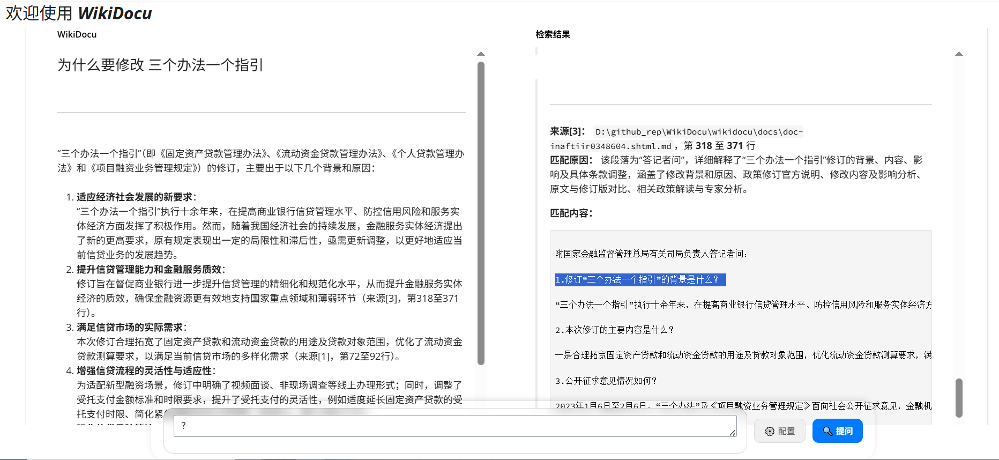
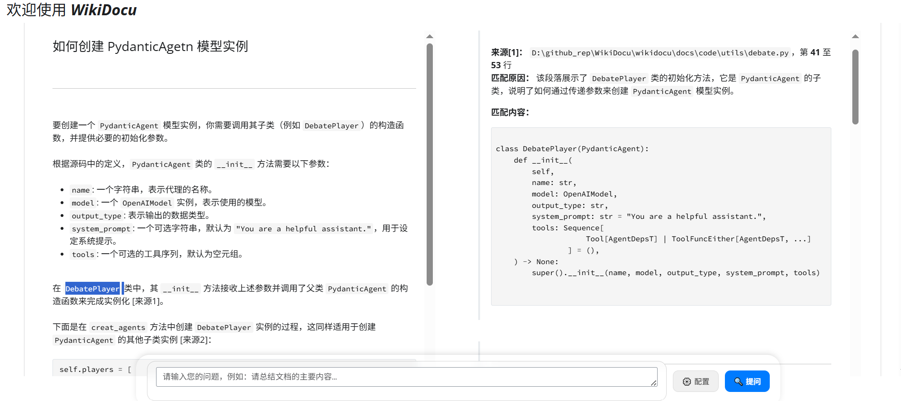

# WikiDocu - 基于大模型的本地智能文档问答系统

*   **归纳海量文档，一问精准直达**
*   **无需检索，直通文档核心——像对话一样读懂文件。**

## 详细介绍

### 痛点与挑战

在日常学习、工作和研发中，我们面临着诸多与文档处理相关的痛点：

*   **信息查找效率低下：** 面对庞大的本地文档库（技术文档、代码、报告等），传统的“文件夹-关键字搜索”方式犹如大海捞针，耗时且难以定位核心信息。
*   **理解成本高昂：** 找到相关文档片段后，往往还需要投入大量时间去阅读和理解上下文，才能获取真正需要的知识。
*   **RAG系统部署繁琐：** 基于检索增强生成（RAG）的系统虽然强大，但需要构建和维护向量数据库、处理复杂的嵌入（Embedding）和检索流程，对技术门槛和计算资源要求较高。
*   **知识难以有效复用：** 个人或团队积累的大量文档和知识，由于缺乏有效的管理和检索工具，常常沉睡在硬盘中，无法转化为即时的生产力。
*   **问答不精准，缺乏依据：** 一些问答系统给出的答案模糊宽泛，或者“ hallucinate ”（编造事实），缺乏明确的出处和上下文支撑，降低了可信度。

### 解决方案: WikiDocu

WikiDocu 是一款创新的本地智能文档问答系统。它独辟蹊径，**无需构建向量数据库或进行复杂的语义检索**，而是直接利用大语言模型（LLM）强大的上下文理解和泛化能力，对用户指定的本地文档（`.md`, `.txt`, `.py` 等）进行全文分析。

#### 系统架构与核心流程

好的，我们来进一步完善“系统架构与核心流程”部分，使其更加清晰、完整，并突出其智能决策和状态管理的特性。

---

### 系统架构与核心流程

WikiDocu 的核心引擎基于 **LangGraph** 构建，形成一个具备状态感知和条件分支能力的智能处理流程。该流程将用户查询、文档内容与大语言模型（LLM）的能力紧密结合，实现从问题到精准答案的自动化流转。其核心流程如下：

1.  **查询理解与增强 (Query Understanding & Enhancement)**
    *   **输入**：用户在 Web UI 或 CLI 中输入的自然语言问题。
    *   **处理**：系统首先调用 LLM 对原始问题进行深度语义解析。LLM 分析用户的真实意图、识别关键实体和概念，并将模糊或宽泛的问题转化为一个或多个更精确、更具可操作性的检索主题（`search_query`）。例如，用户问“这个项目怎么部署？”，系统可能生成 `search_query: "deployment instructions", "installation guide"`。
    *   **输出**：一个或多个优化后的 `search_query`，用于指导后续的文档内容检索。

2.  **智能决策 (Intelligent Routing)**
    *   **输入**：经过增强的 `search_query`。
    *   **处理**：系统进入一个决策节点。LangGraph 根据 `search_query` 的性质进行判断：
        *   **非文档查询**：如果问题属于闲聊、问候或与文档库无关（如“你好吗？”），流程将直接路由到 **直接响应节点**，由 LLM 生成友好回复。
        *   **文档查询**：如果问题明确指向文档内容，则流程触发 **文件内容检索** 步骤。
    *   **输出**：决定后续执行路径（直接响应 或 文件内容检索）。

3.  **文件内容检索 (FileContentExtract)**
    *   **输入**：来自“智能决策”步骤的 `search_query`，以及 `./docs` 目录下的所有支持格式的文件
    *   **处理**：
        *   系统遍历 `./docs` 目录，读取每个文件的内容。根据每个文件内容介绍，决定要访问哪些文件。
        *   对于访问的每个文件，系统将其内容按行号进行格式化（例如，`[行号] 文件内容`），然后将此格式化文本、`search_query` 以及一个预设的结构化输出模板（如 JSON Schema）一同提交给一个专门的 LLM 模块。
        *   该 LLM 模块的任务是：**精确识别**文件中与 `search_query` 高度相关的文本段落。它必须以**结构化输出**（Structured Output）的形式返回结果，包括：
            *   `file_path`: 文件的相对路径。
            *   `start_line`: 相关段落的起始行号。
            *   `end_line`: 相关段落的结束行号。
            *   `reason`: 匹配的原因（简要说明为何此段落相关）。
        *   系统收集所有文件的匹配结果。
    *   **输出**：一个包含所有匹配段落信息（文件路径、行号范围、匹配原因）的结构化结果列表。

4.  **引用内容有效性判断 (Citation Validity Assessment)**
    *   **输入**：来自“文件内容检索”步骤的结构化结果列表。
    *   **处理**：这是新增的关键质量控制环节。系统将检索到的每个匹配段落（根据文件路径和行号范围提取出的原始文本片段）连同其 `reason` 和原始 `search_query` 一起，提交给 LLM 进行**二次验证**。
        *   LLM 的任务是判断：**该段落是否真的、直接地回答了 `search_query` 所代表的查询点？** 它需要评估段落内容的相关性、完整性和准确性。
        *   对于每个段落，LLM 输出一个**有效性判断**（例如：`valid`, `partially_valid`, `invalid`）以及简要的理由。
    *   **输出**：一个经过**有效性过滤和标注**的引用结果列表。无效或低质量的引用被剔除或降权，确保只有高可信度的内容进入后续流程。这一步有效防止了“幻觉”信息或误匹配内容污染最终答案。

5.  **是否满足回答需求判断 (Sufficiency Check)**
    *   **输入**：经过有效性判断后的引用结果列表，以及用户的原始问题。
    *   **处理**：这是核心评估环节。系统调用 LLM，将用户的原始问题与当前已获取的**所有有效引用内容**进行对比分析。
        *   LLM 的任务是判断：**基于这些有效引用，是否已经具备了生成一个完整、准确答案所需的全部信息？** 即，信息是否“充分”？
        *   判断可能产生三种结果：
            *   **充足 (Sufficient)**：信息足够，可以进入最终答案生成。
            *   **不足 (Insufficient)**：信息不完整，需要进行**补充检索**。系统可能需要生成新的、更具体的 `search_query`，或扩大检索范围（如扫描子目录、包含更多文件类型），然后返回到“文件内容检索”步骤。
            *   **无法满足 (Unanswerable)**：经过多轮尝试，系统确认文档库中不存在足够信息来回答该问题。
    *   **输出**：一个关于信息充分性的决策（`sufficient`, `insufficient`, `unanswerable`）。

6.  **引用报告生成 (Citation Report Generation)**
    *   **输入**：来自“是否满足回答需求判断”步骤的、确认为“充足”的有效引用结果列表。
    *   **处理**：系统将这些高质量的、确认有效的引用结果自动整理成一份清晰的、**带有引用的 Markdown 格式报告**。报告中每个匹配项都明确标注了来源文件、行号范围和有效性评估摘要。
    *   **输出**：一份格式化的、高可信度的引用报告。

7.  **最终答案生成 (Final Answer Generation)**
    *   **输入**：用户的原始问题 + 生成的引用报告。
    *   **处理**：将原始问题和详细的引用报告作为上下文，再次调用 LLM。LLM 的任务是综合所有**经过验证的有效信息**，生成一个**最终的、结构化的、易于理解的答案**。答案中会明确标注信息来源（如 `[1]`, `[2]`），并链接到引用报告中的具体条目。
    *   **输出**：一个包含答案和来源引用的最终响应。如果判断为“无法满足”，则生成一个清晰的提示，告知用户“根据现有文档，无法找到相关信息”。

8.  **状态管理与流程控制 (State Management & Orchestration)**
    *   **核心**：整个流程由 **LangGraph** 统一管理。LangGraph 负责：
        *   **状态维护**：保存用户查询、中间结果（`search_query`、检索结果、有效性判断、充分性评估、引用报告）和最终状态。
        *   **流程编排**：根据预定义的图结构和决策逻辑（特别是新增的“有效性判断”和“充分性检查”节点），自动驱动流程流转。它支持**循环**（当判断为“不足”时，返回检索步骤）和**条件分支**。
        *   **错误处理与重试**：在 LLM 调用失败或输出不符合预期时，能够进行重试或执行备用策略。
    *   **优势**：这种基于图的、包含反馈循环的架构确保了交互的连贯性、逻辑的严谨性，并能主动保证答案的质量和完整性，为用户提供高度可信的服务。

整个流程通过 `LangGraph` 管理状态和流转，确保了交互的连贯性和逻辑性。

### 核心亮点与创新

1.  **直接理解，无需索引：** 区别于传统RAG，WikiDocu 直接将文档内容输入LLM，省去了索引构建、向量存储和相似度检索的步骤，极大地简化了部署流程，降低了资源消耗。
2.  **精准问答，出处可循：** 用户提出问题后，WikiDocu 会引导LLM直接在文档中查找相关信息，并能精确地返回相关段落所在的文件名和行号范围，确保答案的准确性和可追溯性。
3.  **双模交互，灵活便捷：**
    *   **Web UI 界面:** 提供直观友好的图形界面，用户可以轻松上传文档、输入问题、查看结构化答案和详细的检索依据。支持通过界面配置模型参数。
    *   **CLI 命令行:** 满足开发者和技术人员的快速查询需求，操作更简洁高效。通过环境变量配置模型参数。
4.  **结构化输出，易于复用：** 系统生成的答案和检索依据均支持 Markdown 格式，不仅美观易读，也方便用户后续整理、分享或集成到其他文档中。
5.  **轻量部署，快速响应：** 简化的架构使得 WikiDocu 易于安装和部署，能够快速响应用户的查询请求。

### 应用场景

*   **技术文档速查：** 快速了解开源项目、SDK或API文档中的关键功能和用法。
*   **代码库理解：** 通过提问快速掌握大型代码库的结构、模块功能和核心逻辑。
*   **研究报告分析：** 从长篇技术报告或论文中快速提取核心观点和数据。
*   **个人知识整理：** 高效管理和检索个人积累的笔记、资料等非结构化文本。
*   **金融合规审查：** 银行或金融机构可以将内部合规政策、法规文档、审计报告等放入系统，通过提问快速核查特定交易或业务流程是否符合规定，提高合规审查效率。
*   **法律合同检索：** 律师事务所或法务部门可利用WikiDocu快速在大量合同中查找特定条款（如违约责任、保密协议有效期等），辅助合同起草和风险评估。
*   **医疗病历分析：** 医院可将结构化的电子病历或诊疗指南输入系统，医生通过自然语言提问快速获取相关诊断建议、用药禁忌或治疗方案，辅助临床决策。
*   **教育资料辅导：** 教师或学生可以将课程讲义、教材内容导入，通过提问快速定位知识点、获取总结或解释，实现个性化学习。

- **示例1：** *为什么要修改 三个办法一个指引*  
根据新浪财经一则 “[国家金融监督管理总局发布《个人贷款管理办法》，7月1日起施行](https://finance.sina.com.cn/wm/2024-02-03/doc-inaftiir0348604.shtml)“ 的新闻内容，开展政策解读、条款查询、适用范围咨询及实际操作指引问答，帮助金融机构和公众准确理解新规要求，规范贷款业务流程，提升合规管理水平。适用于金融行业政策查询、产品咨询。

- **演示视频**: [新闻问答](./imgs/finance.mp4)

- **示例2：** *如何创建 PydanticAgetn 模型实例*  
对本地项目代码进行查询、咨询与问答，深入理解代码逻辑，解决开发中的疑难问题，提升代码维护与协作效率。适用于代码查询、新人培训、故障排查、文档生成、架构解读。

- **演示视频**: [本地项目代码问答](./imgs/coder.mp4)

- **示例3：** *根据文档内容自动生成项目READM*  
根据项目文档内容自动生成结构完整、信息清晰的README文件，涵盖项目简介、安装步骤、使用说明、配置参数、接口文档及常见问题等内容，提升项目可读性与协作效率。适用于项目文档生成、项目介绍、项目协作。

- **演示视频**: [生成项目readme文档](./imgs/generate_readme.mp4)

### 技术实现

*   **核心引擎：** Python, LangChain, LangGraph
*   **交互界面：** Shiny for Python (Web UI), 原生 Python (CLI)
*   **模型支持：** 兼容 OpenAI API 及主流大模型平台（如 SiliconFlow）。
*   **核心技术：**
    *   **LangGraph State Management:** 用于管理对话状态和处理流程。
    *   **LLM 结构化输出（Structured Output / Function Calling）:** 用于精确提取文件内容和生成结构化引用。
    *   **Pydantic (数据模型):** 用于定义和验证 LLM 的结构化输出。
    *   **Markdown (格式渲染):** 用于生成格式化的答案和引用报告。

## 立即体验

项目已开源，只需简单的环境配置和依赖安装，即可快速启动 WikiDocu，开启您的智能文档探索之旅！

### 使用说明

1.  **环境准备：** 安装 Python 3.10+，使用 `pip install -r requirements.txt` 安装依赖。
2.  **启动应用：**
    *   Web UI 模式：运行 `python app_wikidocu.py`，访问 `http://127.0.0.1:8000`。
    *   CLI 模式：运行 `python cli_wikidocu.py`。
3.  **配置模型与源文件目录：**
    *   **Web UI 模式：** 启动应用后，在界面中点击"⚙️ 配置"按钮进行设置。在弹出的模态框中，用户可以配置模型参数（API Key、模型名称、基础 URL）以及源文件目录路径。
    *   **CLI 模式 或 Web UI 默认值：** 设置环境变量 `OPENAI_API_KEY`, `OPENAI_BASE_URL`, `OPENAI_MODEL`。源文件目录默认为 `./docs`。
4.  **开始问答：** 在界面或命令行中输入您的问题。点击"🚀 提问"按钮，系统将处理您的问题并返回结果。

